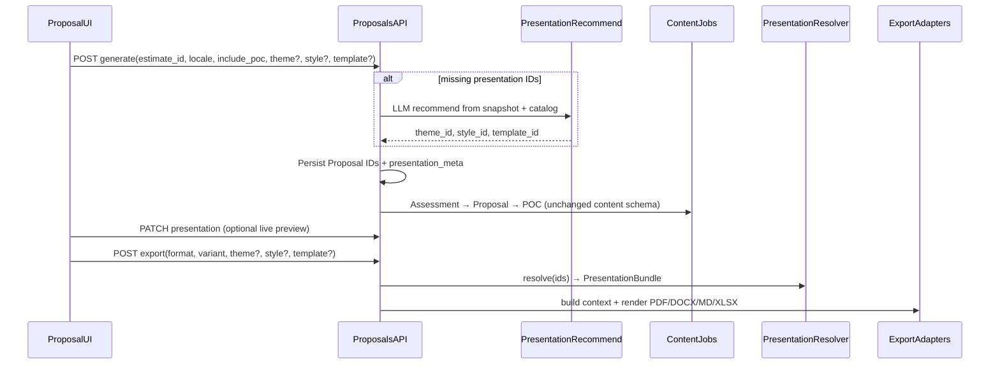

# Proposal Presentation (Theme / Style / Template) Implementation Plan

> **For agentic workers:** Use superpowers:subagent-driven-development or superpowers:executing-plans. Track tasks with checkboxes in this file.

**Goal:** Let users choose **Theme**, **Style**, and **Template** when generating and exporting Proposals so AI content stays fixed while presentation (branding, formatting, layout) becomes flexible, admin-managed, and applied consistently to web preview + all export formats.

**Architecture:** Keep the existing Proposal content pipeline (Assessment → Proposal → POC). Introduce three admin-managed preset catalogs and a **PresentationBundle** resolver. Generate stores preferred IDs (user and/or LLM recommend); Export may override without regenerating content. Adapters (web CSS vars, PDF Jinja, DOCX, MD, XLSX) consume only the resolved bundle.

**Tech stack:** FastAPI + SQLAlchemy + Alembic, existing Proposal AI client / structured JSON, Jinja/WeasyPrint + DOCX/MD/XLSX exporters, Next.js Proposal UI + Admin panel, reuse quotation logo storage pattern for Theme logos.

---

## Locked decisions

| Decision | Choice |
|----------|--------|
| Scope (v1) | Proposal generate + export + in-app web preview only |
| Axes | Theme + Style + Template from day one (2–3 seeded presets each) |
| Timing | Set at Generate (defaults + AI recommend); overridable at Export |
| Presets | Admin CRUD; defaults seeded in code/migration |
| System defaults | Admin can **select** which Theme, Style, and Template are the current defaults (one each) |
| Template meaning | **Presentation layout only** (cover, columns, chrome); AI section IDs stay fixed |
| AI recommend | LLM returns `theme_id` / `style_id` / `template_id` from snapshot + catalog; invalid/fail → **admin-selected defaults** |
| Formats | PDF, DOCX, MD, XLSX + web preview all honor presentation (MD/XLSX best-effort) |
| Pattern | Presentation Bundle + per-format adapters |

---

## Global constraints

- Content generation prompts stay **presentation-agnostic** (do not instruct the model to write for two-column layout).
- Export override of Theme/Style/Template must **not** mutate the Proposal row unless the user explicitly PATCH presentation.
- Unknown/deactivated preset IDs soft-fallback to the **currently selected** default presets; hard `400` only when the client sends an ID that never existed / is malformed.
- Admin may change system defaults at any time; Generate UI, AI fallback, and resolver fallback all read the live defaults.
- Deactivating a preset that is currently default is blocked (or requires promoting another preset to default first).
- Seed `corporate-navy` Theme from today’s [`EXPORT_THEME`](api/app/exports/theme.py) so initial default Theme matches today’s look.
- Safe import edits: never remove unrelated imports when adding modules (see `.cursor/rules/safe-import-edits.mdc`).
- Detailed Report / Quotation presentation wiring is **out of scope** for this plan (reuse bundle later).

---

## Concepts (avoid UI confusion)

| Axis | Controls | Does not control |
|------|----------|------------------|
| **Theme** | Colors, fonts, logo, borders, chart/table colors, callouts, watermark | Page structure, margins density |
| **Style** | Margins, padding, line/paragraph spacing, type scale, list/table metrics, header/footer text sizing | Brand colors, section order |
| **Template** | Cover on/off, column count, section chrome, TOC style, header/footer slots | AI prose, section IDs |

---

## Data flow



---

## Data model

### New tables (or JSONB catalogs under system_config — prefer dedicated tables)

**`presentation_themes`**
- `id` (slug PK), `name`, `description`, `is_default` (bool), `is_active` (bool)
- `config` JSONB — colors, font families, watermark flag, etc.
- `logo_storage_path` nullable
- `updated_at`

**`presentation_styles`** — same shape; `config` = margins, spacing, type scale, table/list metrics

**`presentation_templates`** — same shape; `config` = layout flags (`linear` | `executive_cover` | `two_column`), cover, TOC, chrome, columns, header/footer slots

Exactly one `is_default=true` per catalog among active rows (enforce in service).

### Selecting system defaults

Admins choose the org-wide default for each axis independently:

| Control | Meaning |
|---------|---------|
| Default Theme | Branding used when Generate leaves Theme empty, AI recommend fails, or a Theme ID is invalid/inactive |
| Default Style | Same for Style |
| Default Template | Same for Template |

**Rules**
- Setting preset X as default clears `is_default` on all other presets in that catalog (transactional).
- Default preset must be `is_active=true`.
- Seed migration marks `corporate-navy` / `comfortable` / `classic-linear` as initial defaults; admin can change them afterward.
- Catalog list responses include `is_default` so the UI can show a “Default” badge and prefill Generate selectors.
- Optional convenience endpoint: `PUT /admin/presentation/defaults` body `{ theme_id?, style_id?, template_id? }` to set all three in one call (in addition to “Set as default” on each preset).

### Proposal columns (add)

- `theme_id`, `style_id`, `template_id` (FK/slug refs)
- `presentation_meta` JSONB — e.g. `{ "source": "user"|"ai"|"default", "recommended": {...}, "warnings": [] }`

### ProposalExport columns (add)

- `theme_id`, `style_id`, `template_id` — effective IDs for that export; omit/null means “inherited from Proposal at export time” but **store resolved IDs** on the row for audit.

### Seeded presets (v1)

| Axis | IDs |
|------|-----|
| Theme | `corporate-navy` (default), `modern-slate`, `warm-editorial` |
| Style | `compact`, `comfortable` (default), `spacious` |
| Template | `classic-linear` (default), `executive-cover`, `two-column-summary` |

---

## PresentationBundle

Resolver: `resolve_presentation(theme_id, style_id, template_id) → PresentationBundle`

```text
ids: { theme_id, style_id, template_id }
theme_tokens: colors, fonts, logo_path/url, watermark
style_tokens: margins, spacing, type scale, table/list metrics
layout: template flags (cover, columns, chrome, toc, header/footer)
```

Field-level soft degrade: missing token → corresponding default preset value. Do not fail the whole export for one bad field.

---

## API surface

### Public / full-account

- Extend `POST /proposals/generate` — optional `theme_id`, `style_id`, `template_id`
- `PATCH /proposals/{id}/presentation` — update Proposal presentation IDs without regenerating content
- Extend `POST /proposals/{id}/export` — optional override IDs
- Extend detail/status/summary responses with presentation IDs + `presentation_meta` + display names
- `GET /presentation/themes|styles|templates` — list active presets (id, name, description, `is_default`, preview swatches / layout key)
- `GET /presentation/defaults` — current Default Theme / Style / Template IDs (for Generate prefill)

### Admin

- CRUD under `/admin/presentation/themes|styles|templates`
- **Set as default** per preset (`POST .../{id}/set-default`) and/or `PUT /admin/presentation/defaults`
- Theme logo upload/delete (mirror quotation logo pattern)
- Seed/bootstrap idempotent on migrate; optional admin “reset seeded presets” (does not wipe custom presets unless confirmed)

---

## Backend file map (expected)

| Area | Path |
|------|------|
| Models | New `api/app/models/presentation.py`; extend `api/app/models/proposal.py` |
| Migration | New Alembic revision under `api/alembic/versions/` |
| Schemas | New `api/app/schemas/presentation.py`; extend `api/app/schemas/proposal.py` |
| Resolver | New `api/app/presentation/resolver.py` (+ seed/config validators) |
| AI recommend | New prompt builders + structured schema in proposals AI client |
| Generation | Wire recommend into `api/app/proposals/generation.py` / `service.py` before content jobs |
| Export | Pass bundle through `export_context.py` → `export_formats.py` / `proposal_pack.html.j2` |
| Web CSS source of truth | Prefer bundle → CSS vars; stop hardcoding duplicate hex in `globals.css` for preview |
| Admin router | New or extend admin routes; register in `main.py` |
| Tests | Resolver, generate recommend/fallback, export override isolation, adapter smokes |

---

## Frontend file map (expected)

| Area | Path |
|------|------|
| Selectors | Shared `PresentationSelectors` (Theme / Style / Template + helper text) |
| Generate | Wire into `ProposalPageClient` setup / generate form |
| Preview | Apply CSS vars + layout class from Proposal IDs on `.proposal-theme` |
| Export | Wire into `ProposalExportPanel` (prefill from Proposal; overrides per export) |
| Admin | New tab in `AdminPanel` for presentation presets + Theme logo + **Default Theme / Style / Template** pickers |
| i18n | Labels/helper copy in `en.json` / `ja.json` |
| Types/API | Extend `web/lib/proposal-types.ts`, `web/lib/proposal.ts`; new presentation client helpers |

**UX labels:** Theme = branding/colors; Style = spacing/typography density; Template = page layout. Short helper under each control.

**Defaults UX**
- Admin: three dropdowns (or “Set as default” on each preset row) for Default Theme / Style / Template; show which is current.
- Generate: selectors prefilled with current system defaults; empty/`AI recommend` still allowed to override.
- Catalog: badge “Default” on the active default preset per axis.

---

## Adapter responsibilities

| Adapter | Must |
|---------|------|
| Web preview | CSS variables from theme + style; layout class from template |
| PDF | Layout partial by template; CSS from tokens (no hardcoded navy-only path) |
| DOCX | Fonts/colors/spacing/tables; optional cover page |
| MD | Headings, rules/section chrome conventions; ignore pixel spacing |
| XLSX | Header fill/font from theme; sheet grouping hints from template |

---

## AI recommend

- Separate structured call from content generation
- Input: snapshot facts + active catalog (id + short description)
- Output: `{ theme_id, style_id, template_id, rationale? }`
- Validate against catalog; replace invalid IDs with defaults
- Partial user selection: only fill empty axes
- On failure: use **admin-selected** system defaults; still run content generation; record `source: "default"`

---

## Out of scope (later)

- Detailed Report / Quotation Theme–Style–Template
- Template-driven AI section reorder/omit
- True multi-column reflow, orphan/widow control, magazine/infographic layouts
- Custom uploaded fonts as first-class Theme assets
- Per-user personal Themes
- Pixel-parity MD/XLSX vs PDF
- Auto document-type detection beyond Proposal

---

## Implementation tasks

### Phase 0 — Foundations

- [ ] Add presentation models + Alembic migration (tables + Proposal/ProposalExport columns)
- [ ] Seed 3 Themes / 3 Styles / 3 Templates (`corporate-navy` / `comfortable` / `classic-linear` as initial defaults)
- [ ] Enforce single default per catalog; `set-default` / `PUT .../defaults` APIs
- [ ] Implement `resolve_presentation` + config validators + unit tests (including live default lookup)
- [ ] Public catalog list endpoints + admin CRUD stubs

### Phase 1 — Wire Proposal generate / patch / export IDs

- [ ] Extend generate/export/detail schemas and service persistence
- [ ] `PATCH /proposals/{id}/presentation`
- [ ] Store effective IDs on `ProposalExport`
- [ ] LLM recommend call + fallback; record `presentation_meta`
- [ ] API tests: user IDs / AI IDs / defaults / export override isolation

### Phase 2 — Adapters

- [ ] Inject `PresentationBundle` into `build_proposal_export_context`
- [ ] PDF: token-driven CSS + template layout partials
- [ ] DOCX: map bundle tokens
- [ ] MD + XLSX: best-effort mapping; no crashes
- [ ] Web preview: CSS vars + layout classes from resolved bundle (fetch or embed tokens in detail response)

### Phase 3 — UI + Admin

- [ ] Shared Theme / Style / Template selectors on Generate, Preview, Export
- [ ] Admin presentation presets UI + Theme logo upload
- [ ] Admin UI to select Default Theme / Style / Template (and show current defaults)
- [ ] Generate form prefills from live system defaults
- [ ] i18n helper copy (EN/JA)
- [ ] Smoke: switching Theme changes preview colors without regenerate

### Phase 4 — Hardening

- [ ] Deactivated preset fallback + warnings
- [ ] Idempotent re-seed / “reset defaults” if needed
- [ ] Targeted regression on existing Proposal generate/export tests
- [ ] Brief note in Proposal docs or plan checklist that Detailed Report reuse comes later

---

## Test plan

- [ ] Resolver merge + default fallback
- [ ] Generate with full user IDs
- [ ] Generate with empty IDs → AI recommend (mock) → persisted meta
- [ ] Generate with AI failure → defaults; content still succeeds
- [ ] PATCH presentation updates preview defaults; does not clear AI content
- [ ] Export overrides stored on export row; Proposal IDs unchanged
- [ ] PDF/DOCX/MD/XLSX export with non-default Theme/Style/Template
- [ ] Admin create/update/deactivate preset; catalog list hides inactive
- [ ] Admin can change Default Theme / Style / Template; Generate prefills and AI fallback use the new defaults
- [ ] Cannot deactivate the current default without promoting another first
- [ ] Theme logo missing → render without logo

---

## Success criteria

1. User can pick Theme / Style / Template at Generate (or accept AI recommend).
2. User can change any axis at Export without regenerating Proposal content.
3. Web preview and all four export formats consume the same resolved bundle (with documented best-effort limits for MD/XLSX).
4. Admins can CRUD presets, upload a Theme logo, and **select** the Default Theme / Style / Template independently.
5. Generate prefills and AI/resolver fallback always use the currently selected system defaults.
6. Content prompts and AI section schema remain unchanged.
