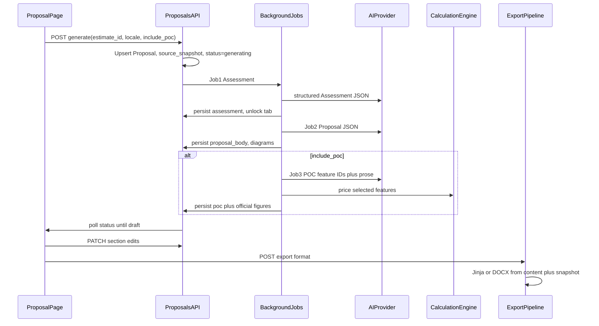

# Proposal Feature Implementation Plan

> **For agentic workers:** Use superpowers:subagent-driven-development or superpowers:executing-plans. Track tasks with checkboxes in the saved plan file after this is approved.

**Goal:** Add `/{locale}/proposal` so full-account users generate, edit, and export stakeholder Assessment + Proposal + optional Proof of Concept packs from calculated estimates—without re-estimating.

**Architecture:** New `Proposal` aggregate (unique on `estimate_id` + `locale`) stores `source_snapshot`, editable section JSON, diagrams, and milestones. Generation runs three background jobs (Assessment → Proposal → Proof of Concept). UI is hybrid tabs + master TOC; Export/Print always emit one continuous pack. Commercials and Proof of Concept pricing come from the estimate engine; AI supplies judgment, prose, Mermaid source, and feature-id selection only.

**Tech stack:** FastAPI + SQLAlchemy + Alembic, existing AI prompt/JSON patterns, Jinja/WeasyPrint/DOCX/XLSX/MD exports, Next.js App Router + next-intl, new `mermaid` client dependency, reuse [`GanttChart`](web/components/GanttChart.tsx) data + [`gantt_svg.py`](api/app/exports/gantt_svg.py) for PDF timelines.

## Global constraints (from approved design)

- Route/nav home: `/{locale}/proposal` (no proof-of-concept page)
- Access: `require_full_account` / hide nav for `account_type === "contact"`
- Cardinality: one active proposal per `(estimate_id, locale)`
- Hybrid UX: tabs navigate; Export/Print = continuous pack + master TOC
- Editable sections before export; autosave; soft stale-source warning only; manual Refresh
- Stakeholder lexicon: no bare NRC/RC/POC abbreviations in Proposal UI or exports
- Proof of Concept: engine prices selected feature items; AI may add “suggested validation window” prose only
- Generation: three sequential, independently retryable jobs
- Export formats: PDF, DOCX, Markdown, Excel (parity with Estimate Export)
- Eligible source estimates: `calculated` | `exported` | `completed`

## Spec first

Write [`docs/superpowers/specs/2026-07-23-proposal-design.md`](docs/superpowers/specs/2026-07-23-proposal-design.md) capturing the consolidated design (IA, data model, generation, stale/refresh, lexicon, export, non-goals). Then save this implementation plan to [`docs/superpowers/plans/2026-07-23-proposal.md`](docs/superpowers/plans/2026-07-23-proposal.md) during execution.

## Data flow

## Backend file map

| Area | Path |
|------|------|
| Model | New [`api/app/models/proposal.py`](api/app/models/proposal.py); register in [`api/app/models/__init__.py`](api/app/models/__init__.py) |
| Migration | New Alembic revision under [`api/alembic/versions/`](api/alembic/versions/) |
| Schemas | New [`api/app/schemas/proposal.py`](api/app/schemas/proposal.py) |
| Service | New [`api/app/proposals/`](api/app/proposals/) (`service.py`, `generation.py`, `snapshot.py`, `poc_pricing.py`, `router.py`) |
| AI | Extend [`api/app/ai/prompts.py`](api/app/ai/prompts.py) + small adapters for three JSON schemas |
| Exports | New `proposal_context.py`, Jinja templates, wire formats in proposal export service; reuse [`pdf.py`](api/app/exports/pdf.py), [`docx.py`](api/app/exports/docx.py), [`gantt_svg.py`](api/app/exports/gantt_svg.py) |
| App | Include router in [`api/app/main.py`](api/app/main.py) |

**Proposal columns (concrete):** `id`, `estimate_id`, `locale`, `include_poc`, `status` (`generating`|`draft`|`ready`|`finalized`), `source_snapshot` JSONB, `assessment` JSONB, `proposal_body` JSONB, `poc` JSONB nullable, `diagrams` JSONB, `milestones` JSONB, `generation_meta` JSONB (run id, part statuses, prompt versions), `source_fingerprint`, `user_id`, timestamps, `finalized_at`. Unique `(estimate_id, locale)`.

**ProposalExport:** `id`, `proposal_id`, `format`, `locale`, `storage_path`, `revision`, `created_at` — mirror Estimate [`Export`](api/app/models/estimate.py) without overloading estimate exports.

## API surface (concrete)

All routes: `Depends(require_full_account)`.

- `GET /proposals` — list current user’s proposals (admin: all)
- `GET /proposals/by-estimate/{estimate_id}?locale=` — get or 404
- `POST /proposals/generate` — body: `estimate_id`, `locale`, `include_poc`; upsert; start background sequence
- `GET /proposals/{id}` — detail + generation part statuses
- `GET /proposals/{id}/status` — poll like estimate extraction
- `PATCH /proposals/{id}/sections` — edit section(s); set `user_edited`
- `POST /proposals/{id}/regenerate` — body: `part` = `assessment`|`proposal`|`poc`|`all`
- `POST /proposals/{id}/refresh` — refresh snapshot-bound figures; preserve `user_edited` prose
- `POST /proposals/{id}/finalize`
- `POST /proposals/{id}/export`, `GET .../exports`, download/delete — formats `pdf`|`docx`|`md`|`xlsx`; variant `full`|`assessment`|`proposal`|`poc`

Generation jobs follow [`BackgroundTasks`](api/app/estimates/router.py) + status poll (2s) pattern from [`EstimateExtraction`](web/components/EstimateExtraction.tsx). Support `PROPOSAL_GENERATE_SYNC=1` for tests (same idea as `EXTRACT_SYNC`).

## Frontend file map

| Area | Path |
|------|------|
| Page | [`web/app/[locale]/proposal/page.tsx`](web/app/[locale]/proposal/page.tsx) — full-account gate like [`rate-cards/page.tsx`](web/app/[locale]/rate-cards/page.tsx) |
| UI | New `web/components/proposal/` — `ProposalPage`, `ProposalSetupBar`, `ProposalTabs`, `ProposalToc`, `ProposalDocument`, `ProposalSectionEditor`, `ProposalStaleBanner`, `ProposalExportPanel`, `ProposalMermaid`, `ProposalGantt` |
| Nav | [`AppHeader.tsx`](web/components/AppHeader.tsx) + [`AppHeaderNav.tsx`](web/components/AppHeaderNav.tsx) + `nav.proposal` in [`en.json`](web/messages/en.json)/[`ja.json`](web/messages/ja.json) |
| Types/API | `web/lib/proposal-types.ts`, `web/lib/proposal.ts` |
| Deep link | From estimate detail when status eligible: link to `/proposal?estimate={id}` |
| Deps | Add `mermaid` to [`web/package.json`](web/package.json) |

**UI behavior:** Setup strip → progress for three jobs → tabs + sticky master TOC → editable sections → Export panel modeled on [`ExportPanel.tsx`](web/components/ExportPanel.tsx). Print CSS flattens all included parts. Stakeholder strings live under a dedicated `proposal` i18n namespace (full words for one-time / monthly costs).

## Mermaid + Gantt in exports

- **Screen:** `mermaid` renders stored `diagrams[].source`.
- **PDF/DOCX:** On successful diagram persist (end of Job 2/3), server renders SVG via a small Node mermaid-cli helper invoked from Python (graceful skip + caption if unavailable in CI). Timeline: stakeholder Gantt/milestones from `source_snapshot.gantt` using extended [`build_gantt_svg`](api/app/exports/gantt_svg.py) (phase bars + milestone markers).

## Proof of Concept pricing

After Job 3 returns selected `feature_item_id`s: [`poc_pricing.py`](api/app/proposals/poc_pricing.py) sums hours from those features, applies pinned rate-card version from the estimate, builds a short timeline; store under `poc.official`. AI field `suggested_validation_window` is prose only.

## Stale source

`source_fingerprint` from estimate `updated_at` + calculation identity. If live estimate differs: banner only; Export allowed with optional confirm; Refresh updates snapshot-bound blocks only.

## Testing

- API integration: generate (sync mode), unique `(estimate_id, locale)`, section patch, refresh preserves edits, POC pricing from fixture features, export creates file for each format, contact user 403
- Frontend: smoke on page gate + TOC/tab switch (light component tests if repo pattern exists)
- Lexicon: assert export context uses full phrases, not `NRC`/`RC`

## Phased delivery order

1. Spec + plan docs  
2. Model/migration/API CRUD + generate skeleton/status  
3. Three AI jobs + POC pricing  
4. Proposal page: picker, progress, tabs, TOC, section edit  
5. Lexicon, Gantt/milestones, Mermaid  
6. Export pack + Export panel parity  
7. Stale banner, Refresh, Finalize, Estimate deep link, polish  

## Out of scope (v1)

- Contact-user proposals  
- Multiple proposals per locale  
- AI-invented POC money/dates  
- Blocking export on stale source  
- Full proposal revision table (history via ProposalExport artifacts)  
